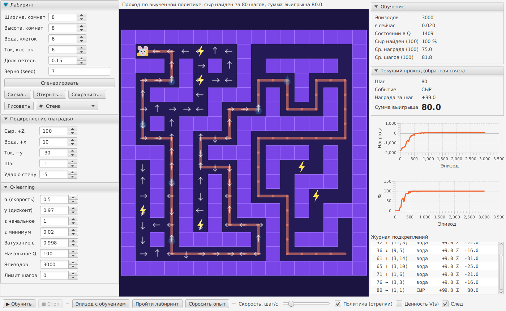

# Задача 1.11. Мышь в лабиринте

Обучение с подкреплением: мышь ищет в конце лабиринта сыр (**+Z**), по пути пьёт воду (**+x**)
и избегает электротравмы (**−y**). На каждом шаге среда сообщает мыши величину выигрыша
или проигрыша (подкрепление), мышь накапливает опыт в Q-таблице и со временем выбирает лучший маршрут.

Стек: **Java 21, Spring Boot 3, JavaFX 21, Lombok, Maven**.



## Запуск

```bash
cd mouse-maze
mvn javafx:run                    # GUI
mvn spring-boot:run               # GUI через Spring Boot plugin
mvn spring-boot:run -Dspring-boot.run.arguments="--app.mode=console --maze.seed=42"   # консоль
mvn test                          # тесты
```

Любой параметр из `application.yml` переопределяется аргументом: `--maze.width=15 --reward.shock=-50`.

## Постановка задачи

| Элемент | Обозначение | Награда (по умолчанию) |
|---|---|---|
| Сыр — цель, конец эпизода | `C` | +Z = +100 |
| Вода — один раз за эпизод на каждую клетку | `W` | +x = +10 |
| Электроток — при каждом входе | `E` | −y = −30 |
| Шаг | — | −1 (стимул искать короткий путь) |
| Удар о стену (мышь остаётся на месте) | `#` | −5 |

Без обратной связи мышь не знает, какое действие лучше. Среда (`MazeEnvironment`) на каждое действие
возвращает `StepResult`: новое состояние, награду, событие и признак конца эпизода. Сумма выигрыша
отображается на каждом шаге.

## Алгоритм — Q-learning

```
Q(s,a) ← Q(s,a) + α · [ r + γ · max_a' Q(s',a') − Q(s,a) ]
```

* **Состояние** `s = (позиция, маска выпитой воды)`. Маска нужна, чтобы процесс был марковским:
  до и после питья одна и та же клетка — разные ситуации.
* **Действия**: вверх, вниз, влево, вправо.
* **Стратегия** ε-жадная: с вероятностью ε случайный ход (исследование), иначе лучший по Q.
  ε затухает после каждого эпизода: `ε ← max(ε_min, ε·decay)`.
* **Оптимистичная инициализация** `Q₀ = 100 ≈ Z`: неиспытанные действия кажутся выгодными, и мышь
  систематически их пробует. С `Q₀ = 0` в тестовом лабиринте обход тока находился в 12 из 20 запусков,
  с `Q₀ = 100` — в 20 из 20.
* Эпизод прерывается по лимиту шагов (по умолчанию 4 × число проходимых клеток); такое прерывание
  не считается конечным состоянием при обновлении Q.

| Параметр | По умолчанию |
|---|---|
| α — скорость обучения | 0.5 |
| γ — дисконт | 0.97 |
| ε начальное / минимум / затухание | 1.0 / 0.02 / 0.998 |
| Эпизодов | 3000 |

## Лабиринт

* **Генерация** любого размера: DFS с возвратом (recursive backtracker) по сетке «комнат»
  (итоговая сетка `2·W+1 × 2·H+1`), затем удаляется доля внутренних стен (`loop-factor`),
  чтобы появились альтернативные пути: короткий через ток или длинный в обход.
  Сыр — слева вверху, мышь — справа внизу, вода и ток расставляются случайно; `seed` делает генерацию воспроизводимой.
* **Схема пользователя**: текстовый файл, окно «Схема…» или рисование мышкой по полю (кнопка «Рисовать»).
  Символы: `#` стена, `.` проход, `M` мышь, `C` сыр, `W` вода, `E` ток, строки с `;` — комментарии.
  Схема проверяется: одна мышь, один сыр, сыр достижим. Пример: `src/main/resources/mazes/example.txt`.

## Структура

```
com.vadim.maze
├── configuration   MazeProperties, RewardProperties, LearningProperties, AppProperties, RandomConfiguration
├── model           Maze, CellType, Position, Action, MouseState, StepResult, StepEvent, EpisodeStats, TrainingSummary
├── service         MazeGenerator, MazeParser, MazeValidator, MazeService,
│                   MazeEnvironment, QLearningAgent, TrainingSession, TrainingService
├── ui              MazeFxApplication, MazeWindow, MazeCanvas
└── runner          ConsoleRunner
```

## GUI

* Левая панель: параметры лабиринта, награды, гиперпараметры (изменения наград и α/γ действуют сразу).
* **▶ Обучить**: фоновое обучение на N эпизодов, графики средней награды и доли успешных эпизодов.
* **Шаг ▸**: мышь делает ровно один ε-жадный ход с обновлением Q. Видны Q-значения клетки до хода
  (`*` — выбранное действие), жадный это ход или случайный, награда от среды, изменение Q и сумма выигрыша.
  Эпизод продолжается с того же места; когда он завершается (сыр или лимит), попадает в статистику,
  и следующий «Шаг» начинает новый эпизод со старта.
* **■ Стоп**: прерывает фоновое обучение или анимацию прохода.
* **Эпизод с обучением**: один ε-жадный эпизод с анимацией.
* **Пройти лабиринт**: проход по выученной политике без случайности; справа виден шаг, событие,
  награда за шаг и **сумма выигрыша**, внизу журнал подкреплений.
* Слои: стрелки политики (лучшее действие в каждой клетке), тепловая карта ценности V(s), след мыши.

## UML

Исходники PlantUML и PNG лежат в `docs/uml/`:

| Диаграмма | Файл |
|---|---|
| Прецедентов | [use-case.png](docs/uml/use-case.png) |
| Деятельности | [activity.png](docs/uml/activity.png) |
| Классов | [class.png](docs/uml/class.png) |
| Взаимодействий (последовательности) | [sequence.png](docs/uml/sequence.png) |
| Состояний | [state.png](docs/uml/state.png) |
| Компонентов | [component.png](docs/uml/component.png) |

Перерисовать: `java -jar plantuml.jar -charset UTF-8 -tpng docs/uml/*.puml`.
